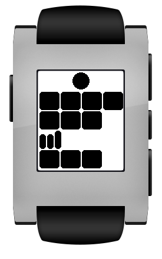
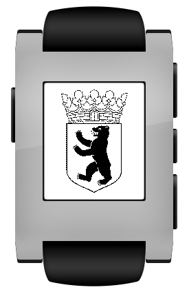

BerlinClock
===========

Pebble watch face of the great Mengenlehreuhr in my home town Berlin, Germany. During my childhood the clock was situated in the middle of the Kurfürstendamm in Western Berlin. I can still remember my Mom and Dad explaining how to read the clock. My Grandma always peeked at her watch to tell the time :-)

It is quite easy once you've been told.

* The flashing dot is the seconds (it is on one second and off one second)
* The first row of rectangles are 5 hours each.
* The second row of rectangles is one hour each.
* The third row is 5 minutes each.
* The fourth row is one minute each.
* Add it all up and you got the time.

That's it. An example?

It's 4x5h+3h:3x5min+3min o'clock a.k.a. 23:18 a.k.a. 11:18 pm

For more details read the article on Wikipedia (http://en.wikipedia.org/wiki/Mengenlehreuhr)

As a tribute to my home town I also added a splash screen.

